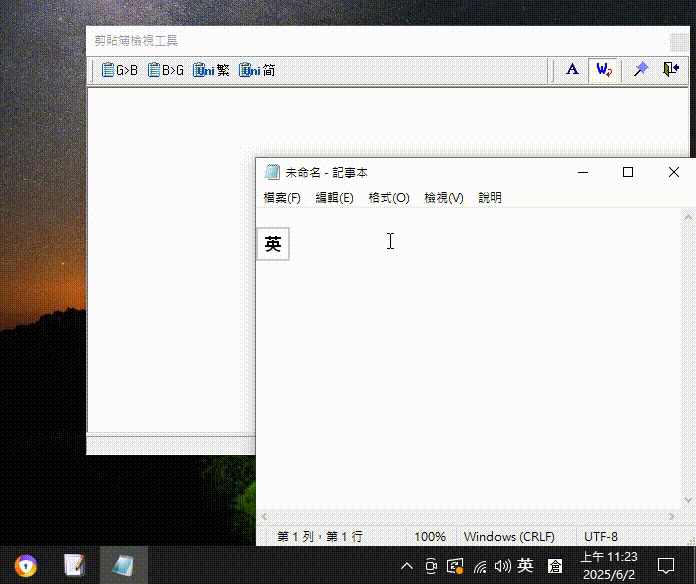

# 🗂️ Windows剪貼簿一鍵清理工具

[](https://opensource.org/licenses/MIT)
[](https://www.microsoft.com/windows)
[](https://dotnet.microsoft.com/download/dotnet-framework)

一個輕量級的Windows系統工具，讓您透過右鍵選單快速清空剪貼簿內容，保護隱私資料不被意外存取。

## ✨ 功能特色

- 🖱️ **右鍵整合** - 在任何檔案或桌面空白處右鍵即可使用
- ⚡ **一鍵清理** - 瞬間清空剪貼簿所有內容
- 🔒 **隱私保護** - 防止敏感資料被其他程式讀取
- 🛠️ **自動安裝** - 智慧偵測系統架構並自動部署
- 💾 **輕量設計** - 不到100KB的小巧工具
- 🔧 **免安裝** - 執行一次即可永久使用

## 🖼️ 使用展示

### 安裝完成後的右鍵選單


### 一鍵清理示範


## 📋 系統需求

- **作業系統**: Windows 7/8/8.1/10/11 (32位元/64位元)
- **框架需求**: .NET Framework 4.0 或更高版本
- **權限需求**: 安裝時需要管理員權限
- **磁碟空間**: 少於 1MB

## 🚀 快速開始

### 方法一：直接下載執行
1. 下載 `ClearClipboard.bat` 檔案
2. 右鍵點選檔案 → 選擇「以系統管理員身分執行」
3. 在UAC提示中點選「是」
4. 等待安裝完成提示
5. 現在您可以在任何地方右鍵看到「一鍵清理剪貼簿」選項

### 方法二：從原始碼執行
```bash
git clone https://github.com/your-username/clipboard-clear-tool.git
cd clipboard-clear-tool
# 右鍵以管理員身分執行 ClearClipboard.bat
```

## 📖 詳細說明

### 安裝過程
工具會自動執行以下步驟：
1. 檢查並要求管理員權限
2. 偵測系統架構和.NET Framework
3. 動態編譯C#程式為執行檔
4. 將執行檔部署到系統目錄
5. 註冊右鍵選單項目到Windows登錄檔

### 使用方法
安裝完成後，您可以在以下位置使用：
- 📁 任何檔案上右鍵 → 「一鍵清理剪貼簿」
- 🖥️ 桌面空白處右鍵 → 「一鍵清理剪貼簿」
- 📂 資料夾空白處右鍵 → 「一鍵清理剪貼簿」

## 🔧 進階功能

### 日誌檢查
安裝過程的詳細日誌儲存在：
```
%temp%\ClipInstaller.log
```

### 手動解除安裝
如需移除工具，請執行：
```bash
# 下載並執行解除安裝工具
tools/uninstall.bat
```

## 🛠️ 開發資訊

### 技術架構
- **批次腳本**: 主要安裝與部署邏輯
- **C# 程式**: 實際的剪貼簿清理功能
- **Windows 登錄檔**: 右鍵選單整合

### 原始碼結構
```
src/
├── ClearClipboard.bat    # 主要安裝腳本
└── ClipboardClear.cs     # C# 剪貼簿清理程式
```

### 建置說明
工具會自動使用系統內建的.NET Framework編譯器：
- 64位元系統：`Framework64\v4.0.30319\csc.exe`
- 32位元系統：`Framework\v4.0.30319\csc.exe`

## 🐛 疑難排解

### 常見問題

**Q: 執行時出現「不應有 {」錯誤**
A: 請確保以系統管理員身分執行，並檢查.NET Framework是否正確安裝。

**Q: 右鍵選單沒有出現**
A: 請檢查安裝日誌檔案，確認登錄檔寫入是否成功。

**Q: 點選選單項目沒有反應**
A: 可能是執行檔權限問題，請嘗試重新以管理員身分安裝。

更多問題請參考：[疑難排解指南](docs/troubleshooting.md)

## 📄 授權資訊

本專案採用 MIT 授權條款，詳見 [LICENSE](LICENSE) 檔案。

## 🤝 貢獻指南

歡迎提交 Issue 和 Pull Request！

1. Fork 本專案
2. 建立您的功能分支 (`git checkout -b feature/AmazingFeature`)
3. 提交您的變更 (`git commit -m 'Add some AmazingFeature'`)
4. 推送到分支 (`git push origin feature/AmazingFeature`)
5. 開啟一個 Pull Request

## 📞 聯絡資訊

- 🐛 回報問題：[GitHub Issues](https://github.com/your-username/clipboard-clear-tool/issues)
- 💡 功能建議：[GitHub Discussions](https://github.com/your-username/clipboard-clear-tool/discussions)
- 📧 電子郵件：your-email@example.com

## ⭐ 支持專案

如果這個工具對您有幫助，請給我們一個星星 ⭐

## 📊 專案統計


---

**製作時間**: 2025年  
**版本**: v1.0.0  
**最後更新**: 2025年6月