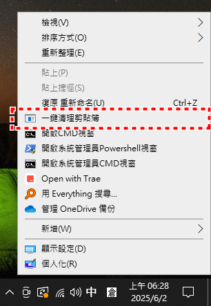
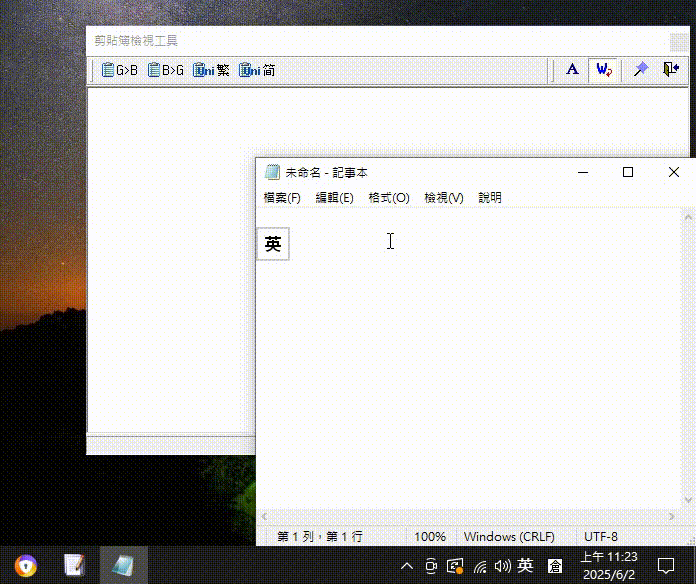

# 🗂️ Windows Clipboard Clear Tool

[](https://opensource.org/licenses/MIT)
[](https://www.microsoft.com/windows)
[](https://dotnet.microsoft.com/download/dotnet-framework)

A lightweight Windows system utility that allows you to quickly clear clipboard contents through the right-click context menu, protecting sensitive data from unauthorized access.

> **Language**: [繁體中文](README.md) | **English**

## ✨ Features

- 🖱️ **Context Menu Integration** - Use from any file or desktop right-click menu
- ⚡ **One-Click Clear** - Instantly clear all clipboard contents
- 🔒 **Privacy Protection** - Prevent sensitive data from being accessed by other programs
- 🛠️ **Auto Installation** - Smart system architecture detection and automatic deployment
- 💾 **Lightweight Design** - Less than 100KB compact utility
- 🔧 **Installation-Free** - Run once for permanent use

## 🖼️ Screenshots

### Right-Click Context Menu


### Clear Demonstration


## 📋 System Requirements

- **OS**: Windows 7/8/8.1/10/11 (32-bit/64-bit)
- **Framework**: .NET Framework 4.0 or higher
- **Permissions**: Administrator privileges required for installation
- **Disk Space**: Less than 1MB

## 🚀 Quick Start

### Method 1: Direct Download & Run
1. Download the `ClearClipboard.bat` file
2. Right-click the file → Select "Run as administrator"
3. Click "Yes" in the UAC prompt
4. Wait for installation completion
5. Now you can see "Clear Clipboard" option in any right-click menu

### Method 2: From Source Code
```bash
git clone https://github.com/your-username/clipboard-clear-tool.git
cd clipboard-clear-tool
# Right-click ClearClipboard.bat and run as administrator
```

## 📖 Detailed Guide

### Installation Process
The tool automatically performs the following steps:
1. Check and request administrator privileges
2. Detect system architecture and .NET Framework