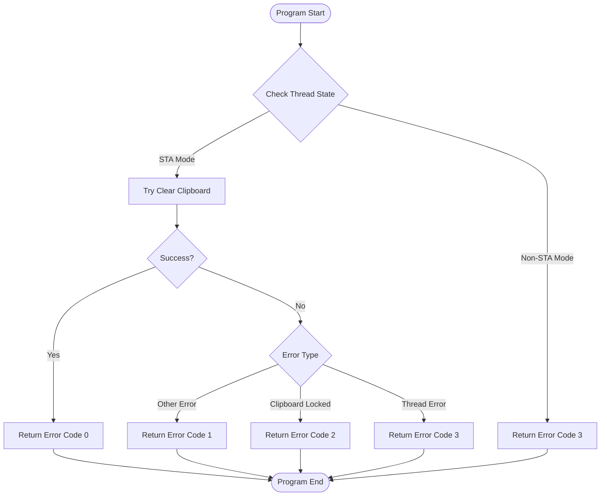

# Clipboard Cleaner Tool Flowchart

## Process Logic Analysis
1. Program starts with `[STAThread]` attribute to ensure single-threaded mode
2. Main program uses try-catch structure to handle various exceptions
3. Different error codes are returned to indicate execution status

## Flowchart

## Error Code Description
| Error Code | Description |
|------------|-------------|
| 0 | Successfully cleared clipboard |
| 1 | Unknown error |
| 2 | Clipboard locked by other program |
| 3 | Thread mode requirement not met |

## Notes
1. Program must run in STA (Single-threaded Apartment) mode
2. Uses Windows Forms Clipboard class for operations
3. Runs in windowless mode, all results returned via error codes