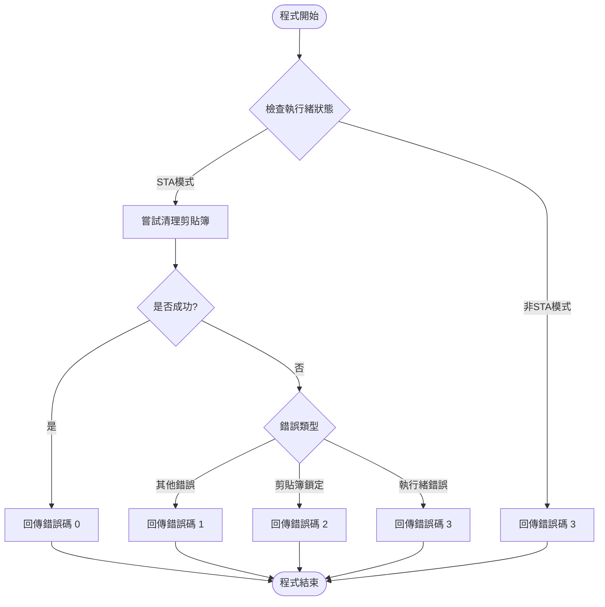

# 剪貼簿清理工具流程圖

## 程序邏輯分析
1. 程式啟動時使用 `[STAThread]` 特性確保在單執行緒模式運行
2. 主程式使用 try-catch 架構處理各種可能的異常
3. 使用不同的錯誤碼回傳執行結果狀態

## 流程圖

## 錯誤碼說明
| 錯誤碼 | 說明 |
|--------|------|
| 0 | 成功清理剪貼簿 |
| 1 | 未知錯誤 |
| 2 | 剪貼簿被其他程式鎖定 |
| 3 | 執行緒模式不符要求 |

## 注意事項
1. 程式必須在 STA (Single-threaded Apartment) 模式下運行
2. 使用 Windows Forms 的 Clipboard 類別進行操作
3. 採用無視窗模式運行，所有結果透過錯誤碼回傳